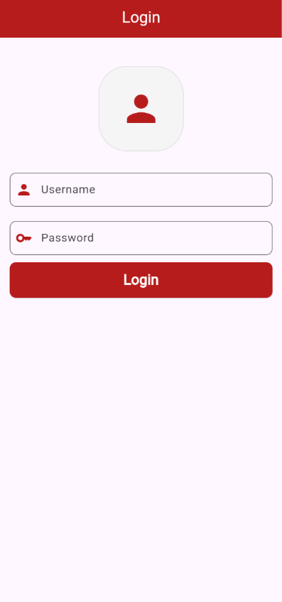
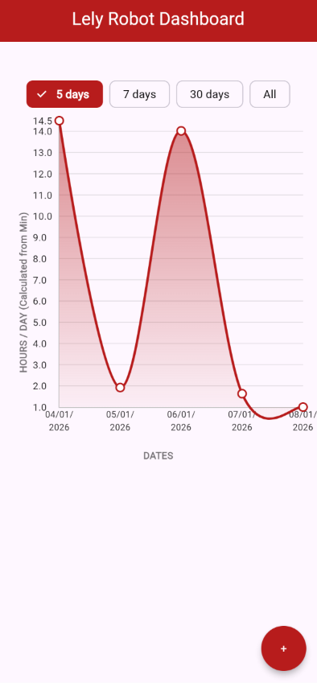
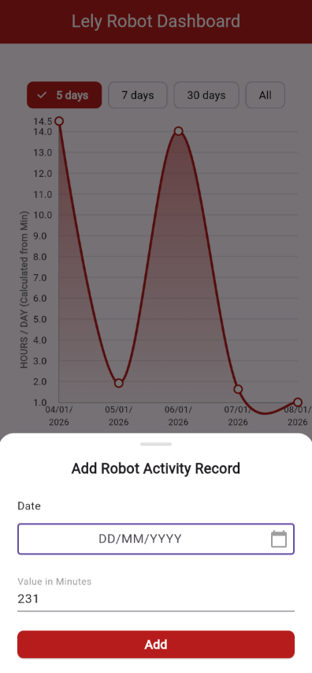

# lely_robot_dashboard

## Introduction

A flutter application designed to show and monitor robot uptime activity. This project demonstrates a clean and scalable architecture using Cubit for state management, fl_chart for dashboard information, includes unit and widget tests.

<table>
  <tr>
    <td></td>
    <td></td>
    <td></td>
  </tr>
</table>

## Features

- "Secure" login screen with form validation
- Line chart visualizing robot activity duration
- Data filtering through line chart for 5 days, 7 days, 30 days or All.
- A bottom sheet with form validation for adding new robot activity
- Duplicate prevention to prevent accidentally logging multiple entries for the same date.

## Stack

- **State management:** `flutter_bloc` (Cubit)
- **Graph library:** `fl_chart`
- **Testing** `flutter_test`, `bloc_test`, `mocktail`
- **Architecture:** Followed the clean architecture method (Data layer, Logic layer, Presentation layer)

## Testing

20 seperate tests were created to test Data and UI logic.

- Unit testing Data sources
- Unit testing Cubit states with `bloc_test`
- Widget testing UI, form validation and cubit integration

The tests can be ran with the following command:

```
flutter test
```

## How to run the app

1. Clone the repository using `git clone <repository>`
2. Ensure you have the Flutter SDK installed
3. Fetch dependencies:

```
flutter pub get
```

4. Run the application (terminal)

```
flutter run
```

If you are using VSCode use `F5` to run debug mode.

## Login details

To access the dashboard hardcoded credentials can be used:

- **Username:** Lely
- **Password:** LelyControl2
